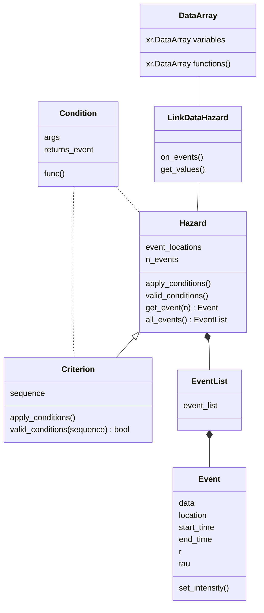
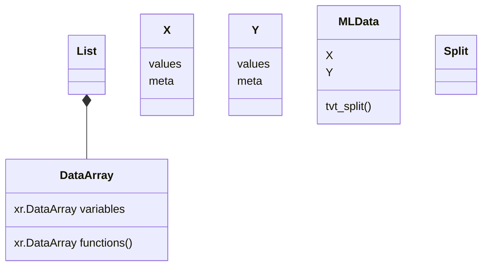

# climpy

 
 

Climpy is working to help climate researchers to analyse climate data, write in formats ready to be used with machine learning models and analyse the accuracy of model predictions

https://github.com/climai/climpy/actions/workflows/python-app.yml/badge.svg

The package is divided into three parts
- Transform: The `transform` module transforms by applying different conditions on your dataset. The class diagram below will detail on the application of the module.

- ml_data: The `ml_data` module creates/writes data to be used conveniently for different kinds of machine learning models. The class diagram below will detail on the application of the module.

- Metrics: The `metrics` module can be applied to observed and simulated variables. This would include exhaustive set of different metrics that can be used on climate related data